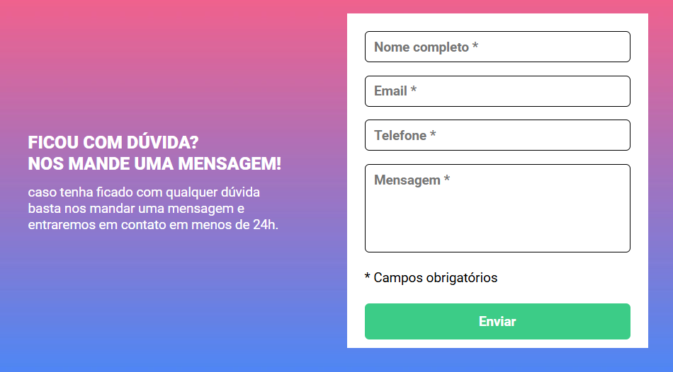
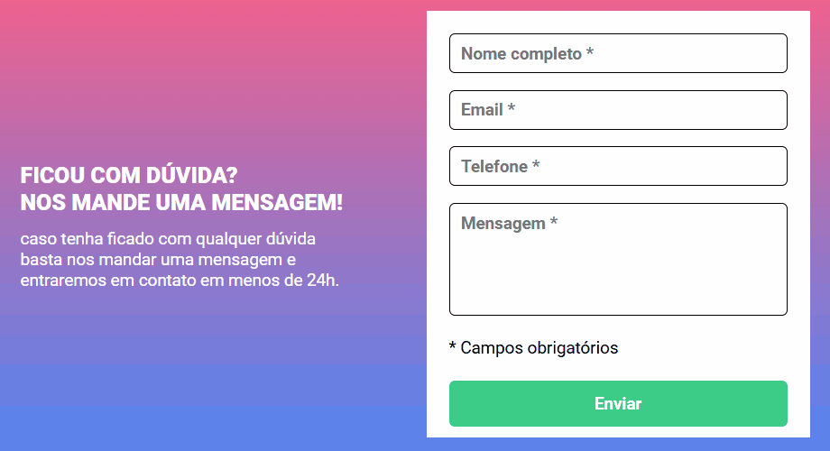

# Formulário com validação - desafio de HTML + CSS + JAVASCRIPT

## Objetivos 🎯

- Criar um formulário com validação de acordor com o seguinte site: (https://www.figma.com/file/zBKnYG9UNdUiIr8ClQTWSG/?node-id=3%3A2).
- A validação do formulário deve ser feita com javascript puro.
- Ao clicar para enviar o formulário, se caso algum campo não estiver preenchido, a borda do input deve ficar vermelha e uma mensagem de "campo obrigatório" deve aparecer embaixo do campo que não foi preenchido, conforme o figma.
- O fundo do formulário deve ser feito usando a imagem em anexo na aula.

## Screenshots

### Elementos interativos

